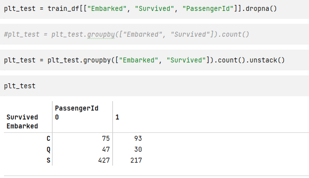
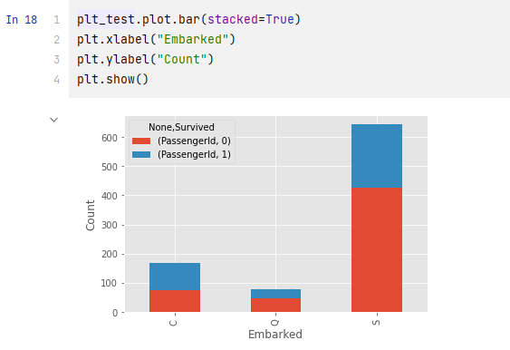
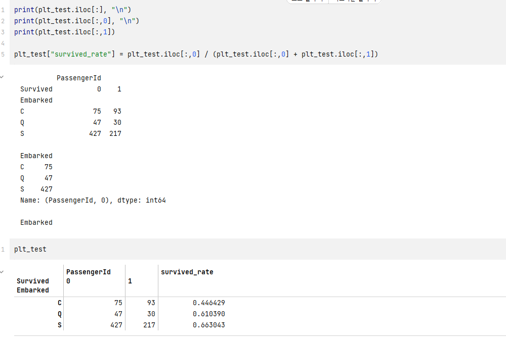
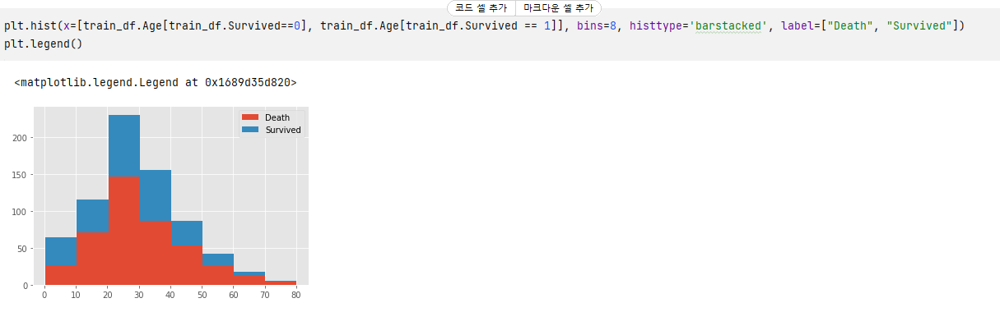
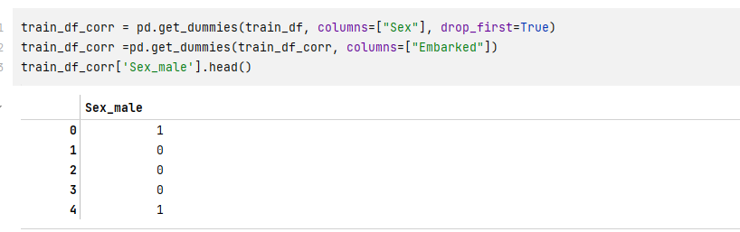
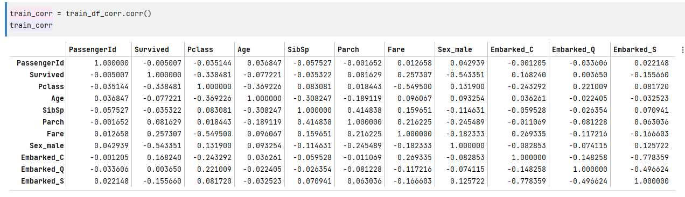
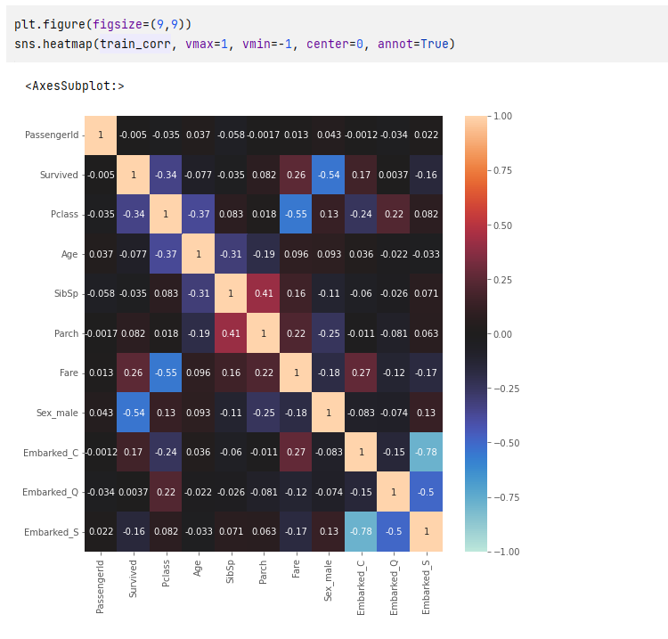

# Kaggle-Data-Analysis

##타이타닉 예제
###1. 데이터 읽기
    데이터를 읽는거는 가장 기본중에 기본
1. 명령어 pd.read_csv()
2. 데이터는 train. test로 구분할 수 있음
3. 결과화면

###2. 데이터 개요 파악
    탐색적 데이터 해석이라고 한다. 구체적으로 몇개에 데이터가 있고, 어떤 데이터를 사용해 시각화 할것인지 정하게 된다.
1. shape : 파일에 구조를 알려준다(열과 행의 갯수)

2. dtypes : 데이터의 속성값을 알려준다.

3. 양적 변수 vs 질적 변수
   1. 질적 변수 : 수치로 수치 사이틔 간격에 의미가 없는 경우(단지 분류를 짓기 위해 (ex.성별))
      1. 명목 척도 : 분류를 위한 것
      2. 순서 척도 : 순서에 의미가 있는것
   2. 양적 변수 : 간격에 의미가 있는 수치
      1. 간격 척도 : 간격을 측정하는 것
      2. 비례 척도 : 비율에 의미가 있는 것

4. describe : 데이터의 통계량 확인 

5. values_counts() : 카터고리 변수 확인 
 데이터프레임["열명"] 형태로 내가 원하는 데이터를 뽑아서 사용할 수 있다.
  이때 데이터의 type은 Series이다

6. isnull(axis=0 or 1)결측값 확인하기
 axis 행(0), 열(1) 기준을 잡는 단위 

###3. 데이터 시각화
      데이터 시각화 라이브러리는 matplotlib, seaborn 사용한다.
1. 내가 원하는 데이터들만 추출해 시각화를 진행한다. 주의할점은 속성과 라벨이 있어서 상관관계를 파악할 수 있다.
2. dropna() 결측값을 포함하고 있는 데이터들을 삭제한다.
3. gropby라는 메소드를 사용해 항목을 분류해 계산한다.

5. 누적 막대기 그래프로 시각화 하기 plot.bar 통해서 시각화

6.수치로 확인 
iloc[행번호, 열번호]로 임의의 행과 열을 추출할 수 있다.

7. 히스토그램으로 시각화 하기

8. 카테고리 변수를 더미 변수화하기

9. 상관 행렬 작성

10. 히트맵으로 시각화

###4. 데이터 전처리와 특징값 생성
###5. 머신러닝 모델링